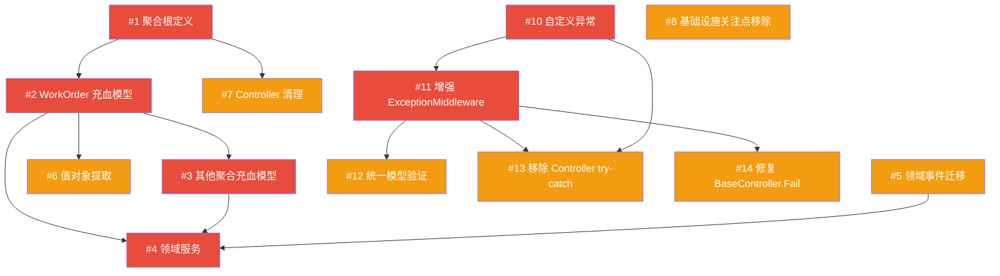

# DDD 重构与全局异常处理方案

> 生成日期: 2026-06-20  
> 目标: 解决后端贫血模型、业务逻辑倒置、聚合边界缺失、全局异常处理不完善等架构问题

---

## 📋 问题总览

| 类别 | 问题数 | 优先级 |
|------|--------|--------|
| 🔴 DDD 核心违规 | 5 | P0 |
| 🟡 DDD 改进项 | 4 | P1 |
| 🔴 全局异常处理缺陷 | 2 | P0 |
| 🟡 异常处理改进项 | 4 | P1 |
| **总计** | **15** | - |

---

## 第一部分: DDD 领域驱动设计重构

### 当前问题诊断

```
当前架构（事务脚本模式）          目标架构（DDD 模式）
┌──────────────────┐          ┌──────────────────┐
│   API Controller  │          │   API Controller  │
│  (含裸 CRUD 操作) │          │    (薄适配层)      │
├──────────────────┤          ├──────────────────┤
│ Application Svc   │          │ Application Svc   │
│ (所有业务逻辑)    │◄── 重构  │ (编排/事务/DTO映射)│
├──────────────────┤          ├──────────────────┤
│ Domain Entities   │          │ Domain Entities   │
│ (纯数据容器)      │──►      │ (充血模型+行为)    │
├──────────────────┤          ├──────────────────┤
│ Infrastructure    │          │ Domain Services   │
│ (IRepository<T>)  │          │ (跨聚合业务逻辑)   │
└──────────────────┘          ├──────────────────┤
                              │ Infrastructure    │
                              │ (聚合约束仓储)     │
                              └──────────────────┘
```

---

### P1 — 聚合根与充血模型（推荐完成）

#### Task #1: 定义聚合根与聚合边界

**严重性:** 🔴 严重 - 所有实体平级，无边界保护

**问题描述:**
- 24 个实体平铺在 `Domain/Entities/` 下，无聚合概念
- 通用 `IRepository<T>` 允许任意 Service 直接操作任意实体
- `QcService` 直接操作 `WorkOrder` + `WorkOrderStep` 的 Repository，跨越聚合边界
- `WorkOrderController` 直接注入 `IRepository<WorkOrder>` 暴露裸 CRUD

**聚合划分方案:**

| 聚合根 | 内部实体 | 说明 |
|--------|---------|------|
| `WorkOrder` | `WorkOrderStep` | 工单聚合，工序由工单统一管理 |
| `Routing` | `RoutingStep` | 工艺路线聚合 |
| `QcInspection` | `QcInspectionItem`, `QcCheckpoint` | 质检聚合 |
| `Bom` | - | BOM 聚合（当前无子实体） |
| `Equipment` | `MaintenancePlan` | 设备聚合 |
| `Material` | - | 物料聚合 |
| `WorkReport` | - | 报工聚合（引用工单，但不拥有） |
| `AndonEvent` | - | 安灯聚合 |
| `Factory` | `Workshop`, `ProductionLine`, `Workstation` | 组织结构聚合 |

**重构方案:**

```
1. 在 Domain 层创建聚合根标记接口

   // src/MES.Domain/AggregateRoots/IAggregateRoot.cs
   public interface IAggregateRoot { }

2. 让聚合根实体实现该接口

   public class WorkOrder : BaseEntity, IAggregateRoot { ... }
   public class Routing : BaseEntity, IAggregateRoot { ... }
   public class QcInspection : BaseEntity, IAggregateRoot { ... }
   // ...

3. 在 Domain 层定义领域仓储接口（仅暴露聚合根，符合依赖倒置原则）

   > **术语说明**：称为"领域仓储接口"而非"聚合仓储接口"，强调这是 Domain 层定义的抽象接口，由 Infrastructure 层实现。

   // src/MES.Domain/Repositories/IWorkOrderRepository.cs
   public interface IWorkOrderRepository
   {
       Task<WorkOrder?> GetByIdAsync(long id);
       Task<IEnumerable<WorkOrder>> GetAllAsync();
       Task<IEnumerable<WorkOrder>> FindAsync(Expression<Func<WorkOrder, bool>> predicate);
       Task<WorkOrder> AddAsync(WorkOrder entity);
       Task UpdateAsync(WorkOrder entity);
       Task DeleteAsync(WorkOrder entity);
       Task<bool> ExistsAsync(Expression<Func<WorkOrder, bool>> predicate);
       Task<int> CountAsync(Expression<Func<WorkOrder, bool>>? predicate = null);
       Task SaveChangesAsync();
   }

4. 内部实体（WorkOrderStep 等）不再有独立仓储
   - 通过聚合根 WorkOrder.Steps 导航属性访问
   - EF Core 会自动跟踪子实体的变更

5. 在 Infrastructure 层实现领域仓储

   // src/MES.Infrastructure/Repositories/WorkOrderRepository.cs
   public class WorkOrderRepository : IWorkOrderRepository
   {
       private readonly MesDbContext _context;
       // 实现细节，内部使用 _context.WorkOrders（含 .Include(wo => wo.Steps)）
   }

6. 移除 Controller 中直接注入 IRepository<T> 的做法
```

**涉及文件:**
- 新建 `src/MES.Domain/AggregateRoots/IAggregateRoot.cs`
- 新建 `src/MES.Domain/Repositories/` 目录（聚合仓储接口）
- 新建 `src/MES.Infrastructure/Repositories/WorkOrderRepository.cs` 等
- 修改 `src/MES.Domain/Entities/WorkOrder.cs` 等聚合根
- 修改 `src/MES.Api/Controllers/WorkOrderController.cs`（移除裸 CRUD）
- 修改 `src/MES.Infrastructure/Data/MesDbContext.cs`（添加 .Include 配置）

**依赖:** 无

---

#### Task #2: 充血模型重构 - WorkOrder 聚合

**严重性:** 🔴 严重 - 贫血模型，所有逻辑在 Service 层

**问题描述:**
- `WorkOrder` 实体所有属性 `public set`，外部可随意修改状态
- 工单状态转换逻辑分散在 `WorkOrderService`、`SchedulingService`、`WorkReportService`、`QcService` 中
- 状态校验规则无统一入口，容易遗漏

**当前代码** (`WorkOrder.cs`):
```csharp
// 所有属性都是 public set
public WorkOrderStatus Status { get; set; }
public decimal CompletedQty { get; set; }
public decimal ScrapQty { get; set; }
```

**目标代码** (`WorkOrder.cs` 重构后):
```csharp
public class WorkOrder : BaseEntity, IAggregateRoot
{
    // ─── 属性: private set 保护不变量 ───
    public string OrderNo { get; private set; } = string.Empty;
    public WorkOrderStatus Status { get; private set; }
    public decimal PlannedQty { get; private set; }
    public decimal CompletedQty { get; private set; }
    public decimal ScrapQty { get; private set; }
    public Priority Priority { get; private set; } = Priority.NORMAL;
    public long? LineId { get; private set; }
    public DateTime? ActualStartTime { get; private set; }
    public DateTime? ActualEndTime { get; private set; }
    // ... 其他属性同样改为 private set

    // ─── 聚合内部集合: 只读暴露 ───
    private readonly List<WorkOrderStep> _steps = new();
    public IReadOnlyCollection<WorkOrderStep> Steps => _steps.AsReadOnly();

    // ─── 导航属性 ───
    public virtual Material? Material { get; private set; }
    public virtual Routing? Routing { get; private set; }

    // ─── EF Core 兼容: protected 无参构造函数 ───
    protected WorkOrder() { }

    // ─── 工厂方法 ───
    public static WorkOrder Create(
        string orderNo, long materialId, decimal plannedQty,
        SourceType sourceType, string? sourceRef = null,
        long? routingId = null, Priority priority = Priority.NORMAL,
        long? factoryId = null, long? workshopId = null)
    {
        return new WorkOrder
        {
            OrderNo = orderNo,
            MaterialId = materialId,
            PlannedQty = plannedQty,
            SourceType = sourceType,
            SourceRef = sourceRef,
            RoutingId = routingId,
            Priority = priority,
            FactoryId = factoryId,
            WorkshopId = workshopId,
            Status = WorkOrderStatus.PENDING
        };
    }

    // ─── 状态转换方法（封装业务规则） ───
    public void Release()
    {
        EnsureStatus(WorkOrderStatus.PENDING, "只有 PENDING 状态的工单才能下达");
        Status = WorkOrderStatus.RELEASED;
    }

    public void Schedule(long lineId)
    {
        EnsureStatus(WorkOrderStatus.RELEASED, "只有 RELEASED 状态的工单才能排产");
        LineId = lineId;
        Status = WorkOrderStatus.SCHEDULED;
    }

    public void Start()
    {
        EnsureStatusOneOf(
            new[] { WorkOrderStatus.SCHEDULED, WorkOrderStatus.RELEASED },
            "工单状态不允许开工");
        Status = WorkOrderStatus.IN_PROGRESS;
        ActualStartTime ??= DateTime.UtcNow;
    }

    public void Hold()
    {
        EnsureStatusOneOf(
            new[] { WorkOrderStatus.RELEASED, WorkOrderStatus.IN_PROGRESS },
            "只有 RELEASED 或 IN_PROGRESS 状态的工单才能暂停");
        Status = WorkOrderStatus.ON_HOLD;
    }

    public void Resume()
    {
        EnsureStatus(WorkOrderStatus.ON_HOLD, "只有 ON_HOLD 状态的工单才能恢复");
        Status = WorkOrderStatus.IN_PROGRESS;
    }

    public void Cancel()
    {
        EnsureStatusOneOf(
            new[] { WorkOrderStatus.PENDING, WorkOrderStatus.RELEASED, WorkOrderStatus.ON_HOLD },
            "当前状态不允许取消工单");
        Status = WorkOrderStatus.CANCELLED;
    }

    public void Complete()
    {
        if (CompletedQty + ScrapQty < PlannedQty)
            throw new DomainException("工单未完成全部数量，不能结案");
        Status = WorkOrderStatus.COMPLETED;
        ActualEndTime = DateTime.UtcNow;
    }

    public void Close()
    {
        EnsureStatus(WorkOrderStatus.COMPLETED, "只有 COMPLETED 状态的工单才能关闭");
        Status = WorkOrderStatus.CLOSED;
    }

    // ─── 报工行为 ───
    public void ReportProgress(decimal goodQty, decimal scrapQty, decimal reworkQty)
    {
        if (Status != WorkOrderStatus.IN_PROGRESS && Status != WorkOrderStatus.SCHEDULED)
            throw new DomainException("工单状态不允许报工");

        var totalReported = CompletedQty + ScrapQty;
        var currentTotal = goodQty + scrapQty + reworkQty;
        if (totalReported + currentTotal > PlannedQty)
            throw new DomainException($"报工数量超过剩余可报工数量，剩余: {PlannedQty - totalReported}");

        if (Status == WorkOrderStatus.SCHEDULED)
            Status = WorkOrderStatus.IN_PROGRESS;

        CompletedQty += goodQty;
        ScrapQty += scrapQty;

        // 自动完成判定
        if (CompletedQty + ScrapQty >= PlannedQty)
        {
            Status = WorkOrderStatus.COMPLETED;
            ActualEndTime = DateTime.UtcNow;
        }
    }

    // ─── 拆单行为 ───
    public WorkOrder Split(decimal splitQty)
    {
        EnsureStatusOneOf(
            new[] { WorkOrderStatus.PENDING, WorkOrderStatus.RELEASED, WorkOrderStatus.SCHEDULED },
            "当前状态不允许拆单");

        if (splitQty <= 0 || splitQty >= PlannedQty)
            throw new DomainException("拆单数量必须大于0且小于原工单数量");

        PlannedQty -= splitQty;

        var child = Create(
            $"{OrderNo}-S", MaterialId, splitQty,
            SourceType.MANUAL, null, RoutingId, Priority,
            FactoryId, WorkshopId);
        child.LineId = LineId;

        return child;
    }

    // ─── 返工行为 ───
    public WorkOrder Rework(decimal reworkQty)
    {
        if (Status != WorkOrderStatus.COMPLETED && Status != WorkOrderStatus.IN_PROGRESS)
            throw new DomainException("只有完工或进行中的工单才能返工");

        if (reworkQty <= 0 || reworkQty > CompletedQty)
            throw new DomainException("返工数量必须大于0且不超过已完成数量");

        CompletedQty -= reworkQty;
        if (Status == WorkOrderStatus.COMPLETED)
            Status = WorkOrderStatus.IN_PROGRESS;

        var reworkOrder = Create(
            $"{OrderNo}-R", MaterialId, reworkQty,
            SourceType.MANUAL, null, RoutingId, Priority,
            FactoryId, WorkshopId);
        reworkOrder.ReworkFromId = Id;

        return reworkOrder;
    }

    // ─── 报废行为 ───
    public void Scrap(decimal scrapQty)
    {
        if (scrapQty <= 0)
            throw new DomainException("报废数量必须大于0");

        ScrapQty += scrapQty;

        // 全部报废则取消
        if (CompletedQty + ScrapQty >= PlannedQty && CompletedQty == 0)
        {
            Status = WorkOrderStatus.CANCELLED;
        }
    }

    // ─── 工序管理（聚合内部） ───
    public void AddStep(WorkOrderStep step)
    {
        _steps.Add(step);
    }

    public void HoldDownstreamSteps(int currentStepOrder)
    {
        foreach (var step in _steps.Where(s => s.StepOrder > currentStepOrder))
        {
            step.Hold();
        }
    }

    // ─── 私有辅助方法 ───
    private void EnsureStatus(WorkOrderStatus expected, string message)
    {
        if (Status != expected)
            throw new DomainException(message);
    }

    private void EnsureStatusOneOf(WorkOrderStatus[] expected, string message)
    {
        if (!expected.Contains(Status))
            throw new DomainException(message);
    }
}
```

**WorkOrderStep 同步重构:**
```csharp
public class WorkOrderStep : BaseEntity
{
    public long WorkOrderId { get; private set; }
    public int StepOrder { get; private set; }
    public string StepName { get; private set; } = string.Empty;
    public WorkOrderStatus Status { get; private set; }
    public decimal CompletedQty { get; private set; }
    public decimal ScrapQty { get; private set; }
    // ... 其他属性改为 private set

    // 行为方法
    public void Complete(decimal goodQty, decimal scrapQty)
    {
        CompletedQty += goodQty;
        ScrapQty += scrapQty;
        Status = WorkOrderStatus.COMPLETED;
    }

    public void Hold() => Status = WorkOrderStatus.ON_HOLD;
    public void Resume() => Status = WorkOrderStatus.IN_PROGRESS;
    public void Start() => Status = WorkOrderStatus.IN_PROGRESS;
}
```

**涉及文件:**
- 修改 `src/MES.Domain/Entities/WorkOrder.cs`
- 修改 `src/MES.Domain/Entities/WorkOrderStep.cs`
- 修改 `src/MES.Application/Services/WorkOrderService.cs`（业务逻辑移至实体）
- 修改 `src/MES.Application/Services/WorkReportService.cs`
- 修改 `src/MES.Application/Services/SchedulingService.cs`
- 修改 `src/MES.Application/Services/QcService.cs`

**依赖:** Task #1（聚合根接口定义）

---

#### Task #3: 充血模型重构 - 其他核心聚合

**严重性:** 🔴 严重

**重构要点:**

#### 3.1 QcInspection 聚合

```csharp
public class QcInspection : BaseEntity, IAggregateRoot
{
    private readonly List<QcInspectionItem> _items = new();
    public IReadOnlyCollection<QcInspectionItem> Items => _items.AsReadOnly();

    public QcResult? InspectResult { get; private set; }
    public WorkOrderStatus Status { get; private set; }

    // 行为
    public void AddItem(QcInspectionItem item) => _items.Add(item);
    
    public void Verify(QcResult result)
    {
        if (Status != WorkOrderStatus.PENDING)
            throw new DomainException("只有待检状态才能判定");
        InspectResult = result;
        Status = WorkOrderStatus.COMPLETED;
    }

    public void HandleNonconforming(NonconformingAction action)
    {
        if (InspectResult != QcResult.FAIL)
            throw new DomainException("只有质检不合格才能处理不合格品");
        // 处理逻辑...
    }
}
```

#### 3.2 Routing 聚合

```csharp
public class Routing : BaseEntity, IAggregateRoot
{
    private readonly List<RoutingStep> _steps = new();
    public IReadOnlyCollection<RoutingStep> Steps => _steps.AsReadOnly();

    public void AddStep(RoutingStep step)
    {
        step.StepOrder = _steps.Count + 1;
        _steps.Add(step);
    }

    public void ReorderSteps(int fromOrder, int toOrder)
    {
        // 步骤重排逻辑
    }
}
```

#### 3.3 Equipment 聚合

```csharp
public class Equipment : BaseEntity, IAggregateRoot
{
    public EquipmentStatus Status { get; private set; }
    
    private readonly List<MaintenancePlan> _maintenancePlans = new();
    public IReadOnlyCollection<MaintenancePlan> MaintenancePlans => _maintenancePlans.AsReadOnly();

    public void SetStatus(EquipmentStatus status)
    {
        // 状态转换校验
        Status = status;
    }

    public void AddMaintenancePlan(MaintenancePlan plan)
    {
        _maintenancePlans.Add(plan);
    }
}
```

**涉及文件:**
- 修改 `src/MES.Domain/Entities/QcInspection.cs`
- 修改 `src/MES.Domain/Entities/QcInspectionItem.cs`
- 修改 `src/MES.Domain/Entities/Routing.cs`
- 修改 `src/MES.Domain/Entities/RoutingStep.cs`
- 修改 `src/MES.Domain/Entities/Equipment.cs`
- 修改 `src/MES.Domain/Entities/MaintenancePlan.cs`
- 修改对应的 Application Service

**依赖:** Task #2

---

### P2 — 领域服务与值对象（可选）

#### Task #4: 创建领域服务

**严重性:** 🔴 严重 - 跨聚合业务逻辑无处安放

**问题描述:**
- Application Service 包含大量跨聚合协调逻辑（如 BOM 校验需要查询 Material 和 Bom 两个聚合）
- OEE 计算、排产策略等纯领域逻辑放在了 Application 层

> **领域服务边界划分原则**：
> - **Domain Service**：纯内存校验（数量范围、状态合法性等无外部依赖的业务规则）
> - **Application Service**：涉及外部查询的协调逻辑（如查库存、查 BOM）
>
> 例如 BOM 库存校验：校验"数量必须大于0"放 Domain，校验"库存是否足够"放 Application（因为需要查询 Material 聚合的库存）

**方案:**

```
src/MES.Domain/
└── Services/
    ├── WorkOrderDomainService.cs     # 状态转换校验 + 数量范围校验
    ├��─ SchedulingDomainService.cs    # 排产策略算法（纯内存）
    └── EquipmentDomainService.cs     # OEE 计算公式（纯公式）
```

**示例代码:**

```csharp
// src/MES.Domain/Services/WorkOrderDomainService.cs
namespace MES.Domain.Services;

public class WorkOrderDomainService
{
    /// <summary>
    /// BOM 库存校验 - 需要跨聚合查询物料和BOM
    /// </summary>
    public void ValidateBomStock(
        WorkOrder workOrder,
        IEnumerable<Bom> bomComponents,
        Func<long, Material?> materialResolver)
    {
        foreach (var bomItem in bomComponents)
        {
            var component = materialResolver(bomItem.MaterialId);
            if (component is null)
                throw new DomainException($"物料 {bomItem.MaterialId} 不存在");

            var requiredQty = bomItem.Quantity * workOrder.PlannedQty;
            if (component.StockQty < requiredQty)
                throw new DomainException(
                    $"物料 {component.Code} 库存不足，需要 {requiredQty}，当前 {component.StockQty}");
        }
    }
}
```

```csharp
// src/MES.Domain/Services/SchedulingDomainService.cs
namespace MES.Domain.Services;

public class SchedulingDomainService
{
    /// <summary>
    /// 按优先级+交期排序 - 纯领域算法，无 I/O
    /// </summary>
    public IReadOnlyList<WorkOrder> PrioritizeOrders(
        IEnumerable<WorkOrder> orders)
    {
        return orders
            .OrderBy(o => o.Priority)        // 紧急优先
            .ThenBy(o => o.PlanEndTime)      // 交期早优先
            .ThenBy(o => o.CreatedAt)        // 先建先排
            .ToList()
            .AsReadOnly();
    }

    /// <summary>
    /// 自动排产 - 轮询产线分配
    /// </summary>
    public Dictionary<long, long> AutoAssign(
        IReadOnlyList<WorkOrder> orders,
        IReadOnlyList<ProductionLine> lines)
    {
        var assignment = new Dictionary<long, long>();
        for (int i = 0; i < orders.Count; i++)
        {
            var line = lines[i % lines.Count];
            assignment[orders[i].Id] = line.Id;
        }
        return assignment;
    }
}
```

```csharp
// src/MES.Domain/Services/EquipmentDomainService.cs
namespace MES.Domain.Services;

public class EquipmentDomainService
{
    /// <summary>
    /// OEE 计算 - 纯领域公式
    /// OEE = 可用率 × 性能率 × 良品率
    /// </summary>
    public decimal CalculateOee(
        decimal availability,
        decimal performance,
        decimal quality)
    {
        return availability * performance * quality;
    }
}
```

**Application Service 重构后的样子:**

```csharp
// src/MES.Application/Services/WorkOrderService.cs（重构后）
public class WorkOrderService : IWorkOrderService
{
    private readonly IWorkOrderRepository _workOrderRepo;
    private readonly IRepository<Material> _materialRepo;
    private readonly IRepository<Bom> _bomRepo;
    private readonly WorkOrderDomainService _domainService;
    private readonly IEventBus? _eventBus;

    public async Task<WorkOrder> CreateWorkOrderAsync(WorkOrder workOrder)
    {
        // 1. 跨聚合查询（Application 层协调）
        var bomComponents = await _bomRepo.FindAsync(b => b.ProductId == workOrder.MaterialId);

        // 2. 领域服务校验（Domain 层规则）
        _domainService.ValidateBomStock(workOrder, bomComponents, id => 
            _materialRepo.GetByIdAsync(id).Result);

        // 3. 聚合根行为（实体方法，已封装规则）
        // workOrder 已经通过 Create 工厂方法设置了 PENDING 状态

        // 4. 持久化
        await _workOrderRepo.AddAsync(workOrder);

        // 5. 发布领域事件
        if (_eventBus is not null)
            await _eventBus.Publish(new WorkOrderCreatedEvent(workOrder));

        return workOrder;
    }

    public async Task ReleaseWorkOrderAsync(long id)
    {
        var wo = await _workOrderRepo.GetByIdAsync(id);
        if (wo is null) throw new DomainException("工单不存在");

        wo.Release();  // ← 实体方法，状态校验在内部

        await _workOrderRepo.UpdateAsync(wo);
    }
}
```

**涉及文件:**
- 新建 `src/MES.Domain/Services/WorkOrderDomainService.cs`
- 新建 `src/MES.Domain/Services/SchedulingDomainService.cs`
- 新建 `src/MES.Domain/Services/EquipmentDomainService.cs`
- 修改 `src/MES.Application/Services/WorkOrderService.cs`
- 修改 `src/MES.Application/Services/SchedulingService.cs`
- 修改 `src/MES.Application/Services/EquipmentService.cs`
- 修改 `src/MES.Api/Program.cs`（注册领域服务）

**依赖:** Task #2, Task #3

---

#### Task #5: 领域事件移至 Domain 层

**严重性:** 🟡 中等 - 事件定义位置错误

**问题描述:**
- `WorkOrderCreatedEvent`、`WorkOrderStatusChangedEvent` 等领域事件定义在 `Application/Integration/Events/`
- 事件是领域概念的一部分，应在 Domain 层定义
- Application 层的 `InMemoryEventLogService` 是基础设施关注点，不应在 Application 层

**方案:**

```
调整后目录结构:

src/MES.Domain/
└── Events/
    ├── DomainEvent.cs                    # 领域事件基类
    ├── WorkOrderCreatedEvent.cs          # 从 Application 层迁移
    ├── WorkOrderStatusChangedEvent.cs    # 从 Application 层迁移
    ├── WorkReportSubmittedEvent.cs       # 从 Application 层迁移
    ├── QcInspectionCompletedEvent.cs     # 从 Application 层迁移
    └── MaterialInventoryUpdatedEvent.cs  # 从 Application 层迁移

src/MES.Application/
└── Integration/
    ├── IEventBus.cs                      # 保留（事件总线是应用层关注点）
    └── InMemoryEventLogService.cs        # 保留（调试工具，应用层关注点）
```

**领域事件基类:**

```csharp
// src/MES.Domain/Events/DomainEvent.cs
namespace MES.Domain.Events;

public abstract class DomainEvent
{
    public Guid Id { get; } = Guid.NewGuid();
    public DateTime OccurredAt { get; } = DateTime.UtcNow;
}
```

**迁移示例:**

```csharp
// src/MES.Domain/Events/WorkOrderCreatedEvent.cs
namespace MES.Domain.Events;

public class WorkOrderCreatedEvent : DomainEvent
{
    public long WorkOrderId { get; init; }
    public string OrderNo { get; init; } = string.Empty;
    public long MaterialId { get; init; }
    public decimal PlannedQty { get; init; }
    public string? SourceRef { get; init; }
}
```

**涉及文件:**
- 新建 `src/MES.Domain/Events/DomainEvent.cs`
- 迁移 `src/MES.Application/Integration/Events/WorkOrderCreatedEvent.cs` → `src/MES.Domain/Events/`
- 迁移 `src/MES.Application/Integration/Events/WorkOrderStatusChangedEvent.cs` → `src/MES.Domain/Events/`
- 迁移 `src/MES.Application/Integration/Events/WorkReportSubmittedEvent.cs` → `src/MES.Domain/Events/`
- 迁移 `src/MES.Application/Integration/Events/QcInspectionCompletedEvent.cs` → `src/MES.Domain/Events/`
- 迁移 `src/MES.Application/Integration/Events/MaterialInventoryUpdatedEvent.cs` → `src/MES.Domain/Events/`
- 修改所有引用这些事件的 Service

**依赖:** 无（可与 Task #2 并行）

---

#### Task #6: 值对象提取

**严重性:** 🟡 中等 - 基础类型缺乏语义

**方案:**

```csharp
// src/MES.Domain/ValueObjects/Quantity.cs
namespace MES.Domain.ValueObjects;

public record Quantity
{
    public decimal Value { get; }
    public string Unit { get; }

    public Quantity(decimal value, string unit = "个")
    {
        if (value < 0)
            throw new DomainException("数量不能为负数");
        Value = value;
        Unit = unit;
    }

    public static Quantity operator +(Quantity a, Quantity b)
    {
        if (a.Unit != b.Unit)
            throw new DomainException("单位不同不能相加");
        return new Quantity(a.Value + b.Value, a.Unit);
    }

    public static Quantity operator -(Quantity a, Quantity b)
    {
        if (a.Unit != b.Unit)
            throw new DomainException("单位不同不能相减");
        return new Quantity(a.Value - b.Value, a.Unit);
    }

    public bool IsZero => Value == 0;
    public bool IsPositive => Value > 0;
}
```

> **注**: 值对象需要 EF Core 的 Value Conversion 配置，目前优先级较低。建议在 P1 阶段只提取 `Quantity`，其余 (`Money`, `Address` 等) 按需添加。

**涉及文件:**
- 新建 `src/MES.Domain/ValueObjects/Quantity.cs`
- 修改 `src/MES.Infrastructure/Data/MesDbContext.cs`（添加 ValueConverter）
- 可选修改 `WorkOrder.cs` 中的 `PlannedQty`/`CompletedQty` 类型

**依赖:** Task #2

---

#### Task #7: Controller 层清理

**严重性:** 🟡 中等 - Controller 越权 + 内嵌 DTO

**问题描述:**
- `WorkOrderController` 直接注入 `IRepository<WorkOrder>` 暴露裸 `Update`/`Delete`
- Controller 内嵌 `SplitRequest`、`ReworkRequest`、`ScrapRequest` 等请求类
- 建议 WorkOrderController 改为继承 BaseController（当前未继承但有 `[ApiController]` 属性，影响较小）

**方案:**

```
1. 移除 Controller 中的 IRepository<T> 注入
   - WorkOrderController 中的 GetAll/GetById/Update/Delete
     全部通过 IWorkOrderService 走

2. 内嵌 DTO 移至 MES.Api/Dtos/ 或 MES.Application/Dtos/
   - WorkOrderController.SplitRequest → WorkOrderDtos.SplitRequest
   - WorkOrderController.ReworkRequest → WorkOrderDtos.ReworkRequest
   - SchedulingController 内嵌类同理

3. WorkOrderController 改为继承 BaseController（可选优化）
```

**涉及文件:**
- 修改 `src/MES.Api/Controllers/WorkOrderController.cs`
- 修改 `src/MES.Api/Controllers/SchedulingController.cs`
- 新建或修改 `src/MES.Application/Dtos/WorkOrderDtos.cs`

**依赖:** Task #1（聚合仓储替代裸 Repository）

---

#### Task #8: 基础设施关注点从 Application 层移除

**严重性:** 🟡 中等

**问题描述:**
- `WorkReportService` 直接依赖 `StackExchange.Redis.IDatabase`
- 防重复提交和批次号生成逻辑硬编码在 Service 中

**方案:**

```csharp
// src/MES.Application/Interfaces/ICacheService.cs — 已存在，扩展方法
public interface ICacheService
{
    // 已有方法
    Task<T?> GetAsync<T>(string key);
    Task SetAsync<T>(string key, T value, TimeSpan? expiry = null);
    Task RemoveAsync(string key);
    Task RemoveByPatternAsync(string pattern);

    // 新增: 防重复提交
    Task<bool> SetIfNotExistsAsync(string key, TimeSpan expiry);
}

// src/MES.Application/Interfaces/IBatchNumberService.cs — 新建
public interface IBatchNumberService
{
    Task<string> GenerateBatchNoAsync(string prefix);
}
```

```csharp
// WorkReportService 重构后
public class WorkReportService
{
    private readonly ICacheService _cache;          // 替代 IDatabase
    private readonly IBatchNumberService _batchNo;  // 替代内联逻辑

    public async Task<WorkReport> SubmitReportAsync(WorkReport report)
    {
        var dedupeKey = $"report:dedup:{report.WorkOrderId}:{report.WorkOrderStepId}";
        if (!await _cache.SetIfNotExistsAsync(dedupeKey, TimeSpan.FromMinutes(5)))
            throw new DomainException("请勿重复提交报工");

        report.BatchNo = await _batchNo.GenerateBatchNoAsync("B");
        // ...
    }
}
```

**涉及文件:**
- 修改 `src/MES.Application/Interfaces/ICacheService.cs`
- 新建 `src/MES.Application/Interfaces/IBatchNumberService.cs`
- 修改 `src/MES.Application/Services/WorkReportService.cs`
- 新建 `src/MES.Infrastructure/Services/BatchNumberService.cs`
- 修改 `src/MES.Api/Program.cs`（DI 注册）

**依赖:** 无

---

#### Task #9: 限界上下文命名空间

**严重性:** 🟢 低 - 隐含划分未显式表达

**方案（长期演进方向）:**

```
当前:
  MES.Domain/Entities/WorkOrder.cs
  MES.Domain/Entities/QcInspection.cs
  MES.Domain/Entities/Equipment.cs

建议:
  MES.Domain/WorkOrderManagement/
  ├── Entities/WorkOrder.cs, WorkOrderStep.cs
  ├── Events/WorkOrderCreatedEvent.cs
  └── Services/WorkOrderDomainService.cs

  MES.Domain/QualityManagement/
  ├── Entities/QcInspection.cs, QcInspectionItem.cs, QcCheckpoint.cs
  ├── Events/QcInspectionCompletedEvent.cs
  └── Services/QcDomainService.cs

  MES.Domain/EquipmentManagement/
  ├── Entities/Equipment.cs, MaintenancePlan.cs
  └── Services/EquipmentDomainService.cs
```

> **注**: 这属于较大范围的重构，建议在以上 Task 完成后再考虑。当前阶段通过目录分组（`Entities/WorkOrder/`）即可，不必立即调整命名空间。

**依赖:** Task #2 ~ #5

---

## 第二部分: 全局异常处理重构

### 当前问题诊断

```
当前异常处理流程:

Controller (try-catch InvalidOperationException)
    ↓ catch → BadRequest(ApiResponse.Fail())
    ↓ 未捕获 → ExceptionMiddleware → 500 ApiResponse

问题:
1. Controller 重复 try-catch，异常被吞掉不记日志
2. ExceptionMiddleware 不区分异常类型，一律 500
3. BaseController.Fail() 返回 HTTP 200
4. 模型验证返回 ValidationProblemDetails，与 ApiResponse 格式不一致
5. 没有自定义异常类型
```

---

### P0 — 异常处理（必须完成）

#### Task #10: 定义自定义异常层次

**严重性:** 🔴 严重 - 无异常分类

**方案:**

```csharp
// src/MES.Domain/Exceptions/DomainException.cs
namespace MES.Domain.Exceptions;

/// <summary>
/// 领域异常基类 - 业务规则违反
/// </summary>
public class DomainException : Exception
{
    public string Code { get; }

    public DomainException(string message, string? code = null)
        : base(message)
    {
        Code = code ?? "DOMAIN_ERROR";
    }

    public DomainException(string message, Exception inner, string? code = null)
        : base(message, inner)
    {
        Code = code ?? "DOMAIN_ERROR";
    }
}
```

```csharp
// src/MES.Domain/Exceptions/BusinessException.cs
namespace MES.Domain.Exceptions;

/// <summary>
/// 业务异常 - 可预期的业务操作失败（如: 库存不足、状态不允许）
/// HTTP 400
/// </summary>
public class BusinessException : DomainException
{
    public BusinessException(string message, string? code = "BUSINESS_ERROR")
        : base(message, code) { }
}
```

```csharp
// src/MES.Domain/Exceptions/EntityNotFoundException.cs
namespace MES.Domain.Exceptions;

/// <summary>
/// 实体未找到异常
/// HTTP 404
/// </summary>
public class EntityNotFoundException : DomainException
{
    public string EntityType { get; }
    public long EntityId { get; }

    public EntityNotFoundException(string entityType, long entityId)
        : base($"{entityType} (Id={entityId}) 不存在", "NOT_FOUND")
    {
        EntityType = entityType;
        EntityId = entityId;
    }
}
```

```csharp
// src/MES.Domain/Exceptions/ValidationException.cs
namespace MES.Domain.Exceptions;

/// <summary>
/// 领域验证异常 - 输入参数不符合业务规则
/// HTTP 422
/// </summary>
public class ValidationException : DomainException
{
    public IDictionary<string, string[]> Errors { get; }

    public ValidationException(IDictionary<string, string[]> errors)
        : base("输入验证失败", "VALIDATION_ERROR")
    {
        Errors = errors;
    }

    public ValidationException(string field, string error)
        : base("输入验证失败", "VALIDATION_ERROR")
    {
        Errors = new Dictionary<string, string[]> { { field, new[] { error } } };
    }
}
```

```csharp
// src/MES.Domain/Exceptions/ForbiddenException.cs
namespace MES.Domain.Exceptions;

/// <summary>
/// 权限不足异常
/// HTTP 403
/// </summary>
public class ForbiddenException : DomainException
{
    public ForbiddenException(string? message = null)
        : base(message ?? "您没有权限执行此操作", "FORBIDDEN") { }
}
```

**异常 → HTTP 状态码映射:**

| 异常类型 | HTTP 状态码 | Code | 场景 |
|---------|------------|------|------|
| `BusinessException` | 400 | `BUSINESS_ERROR` | 库存不足、状态不允许操作 |
| `EntityNotFoundException` | 404 | `NOT_FOUND` | 工单/物料不存在 |
| `ValidationException` | 422 | `VALIDATION_ERROR` | 参数校验失败 |
| `ForbiddenException` | 403 | `FORBIDDEN` | 角色权限不足 |
| `DomainException`(其他) | 400 | `DOMAIN_ERROR` | 通用领域规则违反 |
| `Exception`(未预期) | 500 | `INTERNAL_ERROR` | 系统内部错误 |

**涉及文件:**
- 新建 `src/MES.Domain/Exceptions/DomainException.cs`
- 新建 `src/MES.Domain/Exceptions/BusinessException.cs`
- 新建 `src/MES.Domain/Exceptions/EntityNotFoundException.cs`
- 新建 `src/MES.Domain/Exceptions/ValidationException.cs`
- 新建 `src/MES.Domain/Exceptions/ForbiddenException.cs`

**依赖:** 无

---

#### Task #11: 增强 ExceptionMiddleware

**严重性:** 🔴 严重 - 不区分异常类型

**当前代码** (`ExceptionMiddleware.cs`):
```csharp
catch (Exception ex)
{
    Log.Error(ex, "Unhandled exception: {Message}", ex.Message);
    context.Response.StatusCode = 500;
    var response = new ApiResponse(500, "服务器内部错误");
    // ...
}
```

**重构后:**

```csharp
using System.Net;
using System.Text.Json;
using MES.Domain.Exceptions;
using Serilog;

namespace MES.Api.Middleware;

public class ExceptionMiddleware
{
    private readonly RequestDelegate _next;
    private readonly ILogger<ExceptionMiddleware> _logger;

    public ExceptionMiddleware(RequestDelegate next, ILogger<ExceptionMiddleware> logger)
    {
        _next = next;
        _logger = logger;
    }

    public async Task InvokeAsync(HttpContext context)
    {
        try
        {
            await _next(context);
        }
        catch (Exception ex)
        {
            await HandleExceptionAsync(context, ex);
        }
    }

    private async Task HandleExceptionAsync(HttpContext context, Exception exception)
    {
        context.Response.ContentType = "application/json";

        var (statusCode, response) = exception switch
        {
            BusinessException bex => (
                HttpStatusCode.BadRequest,
                new ApiResponse((int)HttpStatusCode.BadRequest, bex.Message, code: bex.Code)),

            EntityNotFoundException nex => (
                HttpStatusCode.NotFound,
                new ApiResponse((int)HttpStatusCode.NotFound, nex.Message, code: nex.Code)),

            ValidationException vex => (
                HttpStatusCode.UnprocessableEntity,
                new ApiValidationResponse((int)HttpStatusCode.UnprocessableEntity,
                    vex.Message, vex.Errors, code: vex.Code)),

            ForbiddenException fex => (
                HttpStatusCode.Forbidden,
                new ApiResponse((int)HttpStatusCode.Forbidden, fex.Message, code: fex.Code)),

            DomainException dex => (
                HttpStatusCode.BadRequest,
                new ApiResponse((int)HttpStatusCode.BadRequest, dex.Message, code: dex.Code)),

            _ => (
                HttpStatusCode.InternalServerError,
                new ApiResponse(500, "服务器内部错误", code: "INTERNAL_ERROR"))
        };

        context.Response.StatusCode = (int)statusCode;

        // 日志分级
        if (statusCode == HttpStatusCode.InternalServerError)
            Log.Error(exception, "未处理异常: {Message}", exception.Message);
        else
            Log.Warning(exception, "业务异常: {Message}", exception.Message);

        var json = statusCode == HttpStatusCode.UnprocessableEntity
            ? JsonSerializer.Serialize((ApiValidationResponse)response)
            : JsonSerializer.Serialize((ApiResponse)response);

        await context.Response.WriteAsync(json);
    }
}
```

**增强的 ApiResponse:**

```csharp
namespace MES.Api.Middleware;

public class ApiResponse
{
    public int Code { get; set; }
    public string Message { get; set; } = string.Empty;
    public object? Data { get; set; }

    public ApiResponse() { }

    public ApiResponse(int statusCode, string message, object? data = null, string? code = null)
    {
        Code = string.IsNullOrEmpty(code) ? statusCode : MapCodeToInt(code);
        Message = message;
        Data = data;
    }

    public static ApiResponse Ok(object? data = null) => new(0, "success", data);
    public static ApiResponse Fail(string message) => new(1, message);

    private static int MapCodeToInt(string code)
    {
        return code switch
        {
            "BUSINESS_ERROR" => 1,
            "NOT_FOUND" => 2,
            "VALIDATION_ERROR" => 3,
            "FORBIDDEN" => 4,
            "DOMAIN_ERROR" => 5,
            "INTERNAL_ERROR" => 500,
            _ => 1
        };
    }
}

/// <summary>
/// 验证异常响应（包含字段级错误详情）
/// </summary>
public class ApiValidationResponse : ApiResponse
{
    public IDictionary<string, string[]> Errors { get; set; } = new Dictionary<string, string[]>();

    public ApiValidationResponse(int statusCode, string message,
        IDictionary<string, string[]> errors, string? code = null)
        : base(statusCode, message, code: code)
    {
        Errors = errors;
    }
}
```

**涉及文件:**
- 修改 `src/MES.Api/Middleware/ExceptionMiddleware.cs`

**依赖:** Task #10

---

#### Task #12: 统一模型验证响应格式

**严重性:** 🟡 中等 - `[ApiController]` 自动验证格式不一致

**问题描述:**
- `[ApiController]` + DataAnnotation 验证失败时返回 `ValidationProblemDetails`
- 与 `ApiResponse` 格式不一致

**方案:**

在 `Program.cs` 中自定义 `InvalidModelStateResponseFactory`:

```csharp
// src/MES.Api/Program.cs — 在 AddControllers 后添加
builder.Services.AddControllers()
    .ConfigureApiBehaviorOptions(options =>
    {
        options.InvalidModelStateResponseFactory = context =>
        {
            var errors = context.ModelState
                .Where(e => e.Value?.Errors.Count > 0)
                .ToDictionary(
                    e => e.Key,
                    e => e.Value!.Errors.Select(err => err.ErrorMessage).ToArray());

            var response = new ApiValidationResponse(
                422, "输入验证失败", errors, code: "VALIDATION_ERROR");

            return new UnprocessableEntityObjectResult(response);
        };
    });
```

**涉及文件:**
- 修改 `src/MES.Api/Program.cs`

**依赖:** Task #11

---

#### Task #13: 移除 Controller 重复 try-catch

**严重性:** 🟡 中等 - 大量重复模式

**问题描述:**
当前 Controller 中大量重复的 `try-catch (InvalidOperationException)`:

```csharp
// 当前模式（需要移除）
try
{
    await _service.ReleaseWorkOrderAsync(id);
    return Success();
}
catch (InvalidOperationException ex)
{
    return BadRequest(ApiResponse.Fail(ex.Message));
}
```

重构后，这些 catch 块全部移除，异常由 `ExceptionMiddleware` 统一处理:

```csharp
// 重构后（简洁）
[HttpPost("{id}/release")]
public async Task<IActionResult> Release(long id)
{
    await _service.ReleaseWorkOrderAsync(id);
    return Success();
}
```

同时需要将 `WorkOrderService` 中的 `InvalidOperationException` 替换为 `DomainException`:

```csharp
// 当前
throw new InvalidOperationException("只有 PENDING 状态的工单才能下达");

// 替换为
throw new BusinessException("只有 PENDING 状态的工单才能下达");
```

**涉及文件:**
- 修改 `src/MES.Api/Controllers/WorkOrderController.cs`
- 修改 `src/MES.Api/Controllers/SchedulingController.cs`
- 修改 `src/MES.Api/Controllers/DispatchController.cs`
- 修改 `src/MES.Api/Controllers/QcController.cs`
- 修改 `src/MES.Api/Controllers/QcCheckpointController.cs`
- 修改 `src/MES.Application/Services/*.cs`（异常类型替换）

**依赖:** Task #10, Task #11

---

#### Task #14: 修复 BaseController.Fail() 返回 HTTP 200 问题

**严重性:** 🟡 中等

**问题描述:**
`BaseController.Fail()` 返回 `Ok(ApiResponse.Fail(message))`，即 HTTP 200 + 业务失败码。

**方案:**

```csharp
// src/MES.Api/Controllers/BaseController.cs — 重构后
[ApiController]
[Route("api/v1/[controller]")]
public class BaseController : ControllerBase
{
    protected long CurrentUserId =>
        User.FindFirst(ClaimTypes.NameIdentifier) is { } claim ? long.Parse(claim.Value) : 0;

    protected string CurrentUserName => User.FindFirst(ClaimTypes.Name)?.Value ?? string.Empty;

    protected IActionResult Success(object? data = null) => Ok(ApiResponse.Ok(data));

    protected IActionResult Fail(string message, int statusCode = 400) =>
        statusCode switch
        {
            400 => BadRequest(ApiResponse.Fail(message)),
            404 => NotFound(ApiResponse.Fail(message)),
            403 => Forbid(),
            _ => StatusCode(statusCode, ApiResponse.Fail(message))
        };
}
```

> **注**: 重构后大部分场景不再需要手动调用 `Fail()`，因为异常会直接抛给 `ExceptionMiddleware`。此方法保留作为向后兼容。

**涉及文件:**
- 修改 `src/MES.Api/Controllers/BaseController.cs`

**依赖:** Task #11

---

## 📊 重构依赖关系图



---

## 🚀 执行计划

### P0: 异常处理（3-4 天）

> 优先解决异常处理，因为改动范围集中、风险低、收益立竿见影

| 天 | 任务 | 产出 |
|----|------|------|
| Day 1 | Task #10 自定义异常层次 | Domain/Exceptions/ 5个异常类 |
| Day 2 | Task #11 增强 ExceptionMiddleware | 按异常类型分派 + 日志分级 |
| Day 3 | Task #12 统一模型验证 + Task #14 修复 BaseController | 验证格式统一 |
| Day 4 | Task #13 移除 Controller try-catch + 异常类型替换 | 全部 Controller 清理 |

**验收标准:**
- [ ] `DomainException` 及子类定义完成
- [ ] ExceptionMiddleware 按 5 种异常类型返回不同状态码
- [ ] Controller 无重复 try-catch
- [ ] `BaseController.Fail()` 不再返回 HTTP 200
- [ ] 模型验证返回 `ApiValidationResponse` 格式

### P1: 聚合根与充血模型（5-7 天）

> DDD 核心重构，需逐个聚合推进

| 天 | 任务 | 产出 |
|----|------|------|
| Day 5 | Task #1 聚合根定义 + 仓储接口 | IAggregateRoot + 4个聚合仓储接口 |
| Day 6-7 | Task #2 WorkOrder 充血模型 | 状态转换方法 + 报工/拆单/返工行为 |
| Day 8 | Task #3 QcInspection + Routing 聚合 | 质检判定 + 工序管理行为 |
| Day 9 | Task #4 领域服务 | BOM 校验 + 排产策略 + OEE 计算 |
| Day 10-11 | Task #7 Controller 清理 + Task #8 基础设施移除 | Controller 适配 + Redis 抽象 |

**验收标准:**
- [ ] 所有聚合根实体实现 `IAggregateRoot`
- [ ] 聚合内部实体属性改为 `private set`
- [ ] `WorkOrder.Status` 不可被外部直接赋值
- [ ] `WorkOrderController` 不再直接注入 `IRepository<T>`
- [ ] 领域服务包含 BOM 校验、排产、OEE 逻辑

### P2: 领域事件与值对象（3-4 天）

| 天 | 任务 | 产出 |
|----|------|------|
| Day 12 | Task #5 领域事件迁移 | Domain/Events/ 目录 |
| Day 13-14 | Task #6 值对象 + 集成测试 | Quantity 值对象 + EF Core 配置 |
| Day 15 | 全量回归测试 | 所有测试通过 |

**验收标准:**
- [ ] 领域事件在 Domain 层定义
- [ ] `Quantity` 值对象可用
- [ ] 全部现有测试通过
- [ ] `dotnet build` 无 warning

---

## 📝 重构检查清单

### 异常处理

- [ ] #10 `DomainException` + 4 个子异常类创建
- [ ] #11 ExceptionMiddleware 按异常类型分派
- [ ] #11 日志分级（业务 Warning / 系统 Error）
- [ ] #12 模型验证响应格式统一
- [ ] #13 Controller try-catch 全部移除
- [ ] #13 Application Service 中 `InvalidOperationException` → `BusinessException`
- [ ] #14 `BaseController.Fail()` 支持非 200 状态码

### DDD 聚合

- [ ] #1 `IAggregateRoot` 接口定义
- [ ] #1 聚合仓储接口在 Domain 层定义
- [ ] #1 聚合仓储实现在 Infrastructure 层实现
- [ ] #2 `WorkOrder` 属性改为 `private set`
- [ ] #2 `WorkOrder` 添加 Release/Schedule/Start/Hold/Resume/Cancel/Complete/Close 方法
- [ ] #2 `WorkOrder` 添加 ReportProgress/Split/Rework/Scrap 行为方法
- [ ] #2 `WorkOrder._steps` 改为私有集合 + 只读暴露
- [ ] #3 `QcInspection` / `Routing` / `Equipment` 充血模型
- [ ] #4 领域服务创建（WorkOrder/Scheduling/Equipment）
- [ ] #5 领域事件迁移到 Domain/Events/
- [ ] #7 Controller 移除裸 Repository 注入
- [ ] #7 内嵌 DTO 移至 Dtos 目录
- [ ] #8 WorkReportService 移除 Redis 直接依赖

### 整体验收

- [ ] `dotnet build` 零 error 零 warning
- [ ] 全部现有单元测试通过
- [ ] Swagger 页面正常
- [ ] 前端功能无回归（API 契约不变）

---

*End of Plan*
